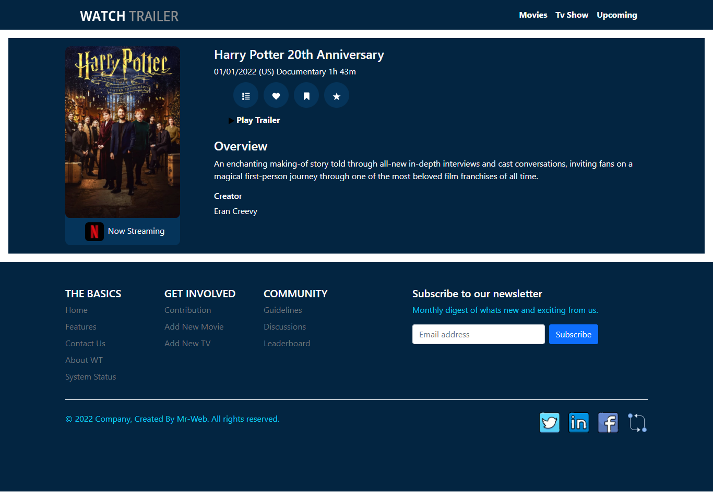

# Movies trailers

Movies trailers app built with Vue.js and Bootstrap.

## What you’ll learn

- Begin with with VUE JS version 3
- Learn some of the basic VUE tools.
-- How to use Vue JS router.
-- How to create views pages and use it.
-- How to create Vue JS components and use it.
- How to use Bootstrap with Vue JS.

## Project setup

- Clone the git repository `git clone https://github.com/mahmoudessam820/Movies-trailers.git`
- Install required packages by running; `npm install`
- Compiles and hot-reloads for development `npm run serve`

## Screenshots

### Home page 

### Movies page 

### TV page 

### Movie details page 

